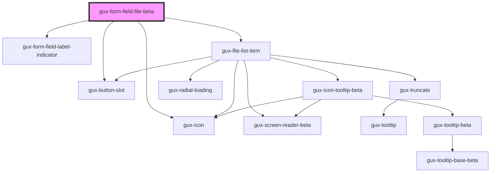

# gux-form-field-file-beta

<!-- Auto Generated Below -->

## Properties

| Property        | Attribute        | Description                                                                                                                                                                                                                                                                     | Type                                 | Default      |
| --------------- | ---------------- | ------------------------------------------------------------------------------------------------------------------------------------------------------------------------------------------------------------------------------------------------------------------------------- | ------------------------------------ | ------------ |
| `dragAndDrop`   | `drag-and-drop`  |                                                                                                                                                                                                                                                                                 | `boolean`                            | `false`      |
| `indicatorMark` | `indicator-mark` | Field indicator mark which can show *, (optional) or blank Defaults to required. When set to required, the component will display * for required fields and blank for optional When set to optional, the component will display (optional) for optional and blank for required. | `"none" \| "optional" \| "required"` | `'required'` |

## Slots

| Slot           | Description                     |
| -------------- | ------------------------------- |
| `"error"`      | Optional slot for error message |
| `"help"`       | Optional slot for help message  |
| `"input"`      | Required slot for input tag     |
| `"label"`      | Required slot for label tag     |
| `"label-info"` | Optional slot for tooltip       |

## Dependencies

### Depends on

- [gux-form-field-label-indicator](../../helper-components/gux-form-field-label-indicator)
- [gux-file-list-item](./components/gux-file-list-item)
- [gux-button-slot](../../../gux-button-slot)
- [gux-icon](../../../gux-icon)

### Graph

----------------------------------------------

*Built with [StencilJS](https://stenciljs.com/)*
