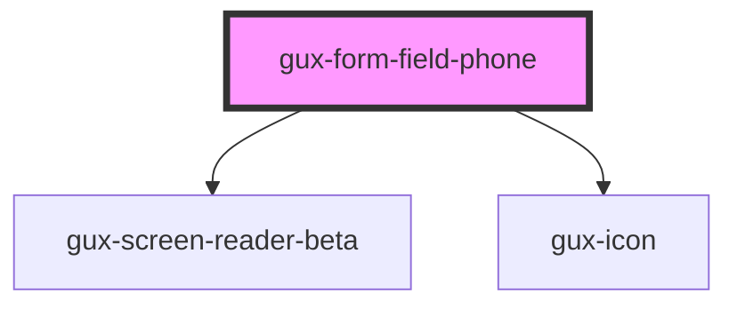

# gux-form-field-phone

<!-- Auto Generated Below -->

## Properties

| Property        | Attribute        | Description | Type                                    | Default     |
| --------------- | ---------------- | ----------- | --------------------------------------- | ----------- |
| `labelPosition` | `label-position` |             | `"above" \| "beside" \| "screenreader"` | `undefined` |

## Slots

| Slot      | Description                                |
| --------- | ------------------------------------------ |
|           | Required slot for gux-phone-input-beta tag |
| `"error"` | Optional slot for error message            |
| `"help"`  | Optional slot for help message             |
| `"label"` | Required slot for label tag                |

## Dependencies

### Depends on

- [gux-screen-reader-beta](../../../../beta/gux-screen-reader)
- [gux-icon](../../../gux-icon)

### Graph

----------------------------------------------

*Built with [StencilJS](https://stenciljs.com/)*
