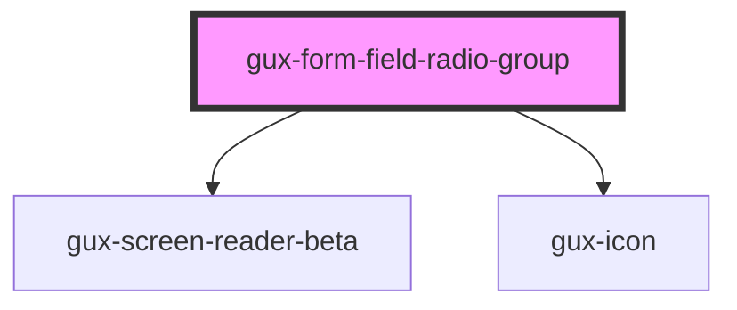

# gux-form-field-radio

<!-- Auto Generated Below -->

## Properties

| Property   | Attribute  | Description                              | Type      | Default |
| ---------- | ---------- | ---------------------------------------- | --------- | ------- |
| `disabled` | `disabled` | Disables the radio buttons in the group. | `boolean` | `false` |

## Slots

| Slot           | Description                          |
| -------------- | ------------------------------------ |
| `"groupError"` | Optional slot for groupError message |
| `"groupHelp"`  | Optional slot for groupHelp message  |
| `"input"`      | Required slot for input tag          |
| `"label"`      | Required slot for label tag          |

## Dependencies

### Depends on

- [gux-screen-reader-beta](../../../../beta/gux-screen-reader)
- [gux-icon](../../../gux-icon)

### Graph

----------------------------------------------

*Built with [StencilJS](https://stenciljs.com/)*
