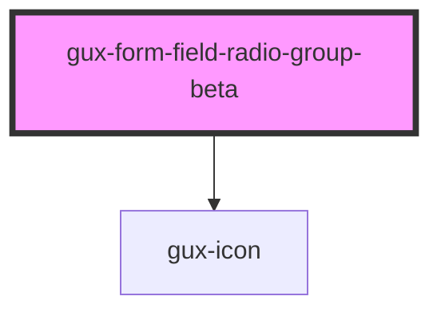

# gux-form-field-radio-group-beta

<!-- Auto Generated Below -->

## Properties

| Property   | Attribute  | Description                              | Type      | Default |
| ---------- | ---------- | ---------------------------------------- | --------- | ------- |
| `disabled` | `disabled` | Disables the radio buttons in the group. | `boolean` | `false` |

## Slots

| Slot            | Description                     |
| --------------- | ------------------------------- |
| `"group-error"` | Optional slot for error message |
| `"group-help"`  | Optional slot for help message  |
| `"group-label"` | Required slot for label tag     |
| `"label-info"`  | Optional slot for tooltip       |

## Dependencies

### Depends on

- [gux-icon](../../../gux-icon)

### Graph

----------------------------------------------

*Built with [StencilJS](https://stenciljs.com/)*
