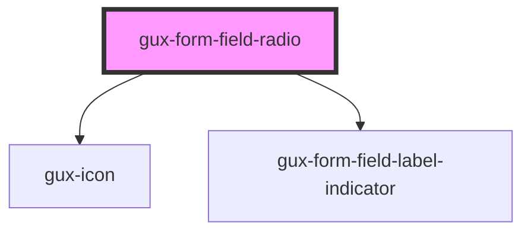

# gux-form-field-radio

<!-- Auto Generated Below -->

## Properties

| Property           | Attribute            | Description | Type      | Default |
| ------------------ | -------------------- | ----------- | --------- | ------- |
| `hasGroupDisabled` | `has-group-disabled` |             | `boolean` | `false` |
| `hasGroupError`    | `has-group-error`    |             | `boolean` | `false` |

## Slots

| Slot      | Description                     |
| --------- | ------------------------------- |
| `"error"` | Optional slot for error message |
| `"help"`  | Optional slot for help message  |
| `"input"` | Required slot for input tag     |
| `"label"` | Required slot for label tag     |

## Dependencies

### Depends on

- [gux-icon](../../../gux-icon)
- [gux-form-field-label-indicator](../../helper-components/gux-form-field-optional-indicator)

### Graph

----------------------------------------------

*Built with [StencilJS](https://stenciljs.com/)*
