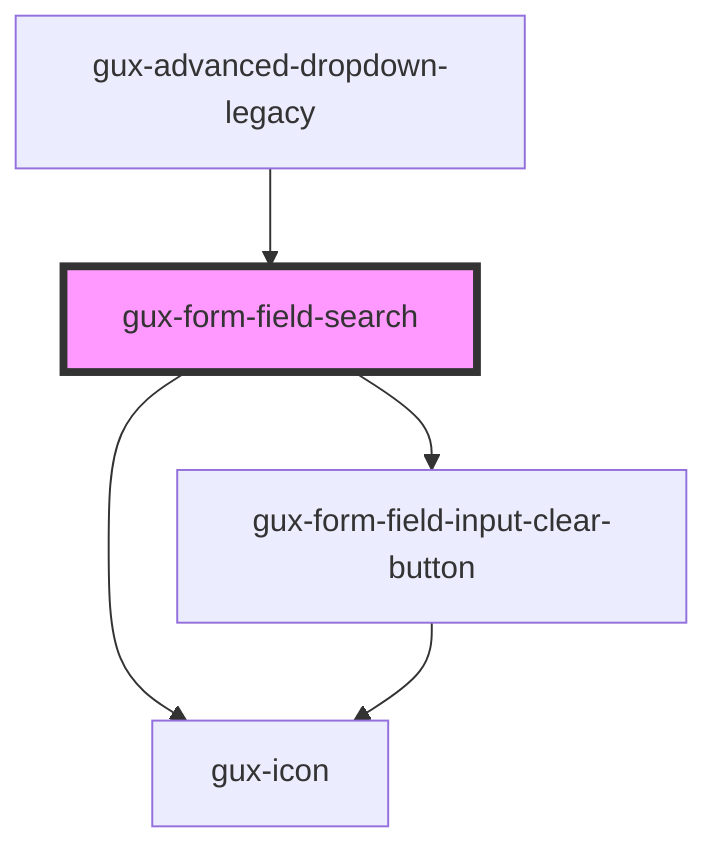

# gux-form-field-search

<!-- Auto Generated Below -->

## Properties

| Property        | Attribute        | Description | Type                                    | Default     |
| --------------- | ---------------- | ----------- | --------------------------------------- | ----------- |
| `labelPosition` | `label-position` |             | `"above" \| "beside" \| "screenreader"` | `undefined` |

## Methods

### `guxForceUpdate() => Promise<void>`

#### Returns

Type: `Promise<void>`

## Slots

| Slot      | Description                     |
| --------- | ------------------------------- |
| `"error"` | Optional slot for error message |
| `"help"`  | Optional slot for help message  |
| `"input"` | Required slot for input tag     |
| `"label"` | Required slot for label tag     |

## Dependencies

### Used by

 - [gux-advanced-dropdown-legacy](../../../../legacy/gux-advanced-dropdown-legacy)

### Depends on

- [gux-icon](../../../gux-icon)
- [gux-form-field-input-clear-button](../../helper-components/gux-form-field-input-clear-button)

### Graph

----------------------------------------------

*Built with [StencilJS](https://stenciljs.com/)*
