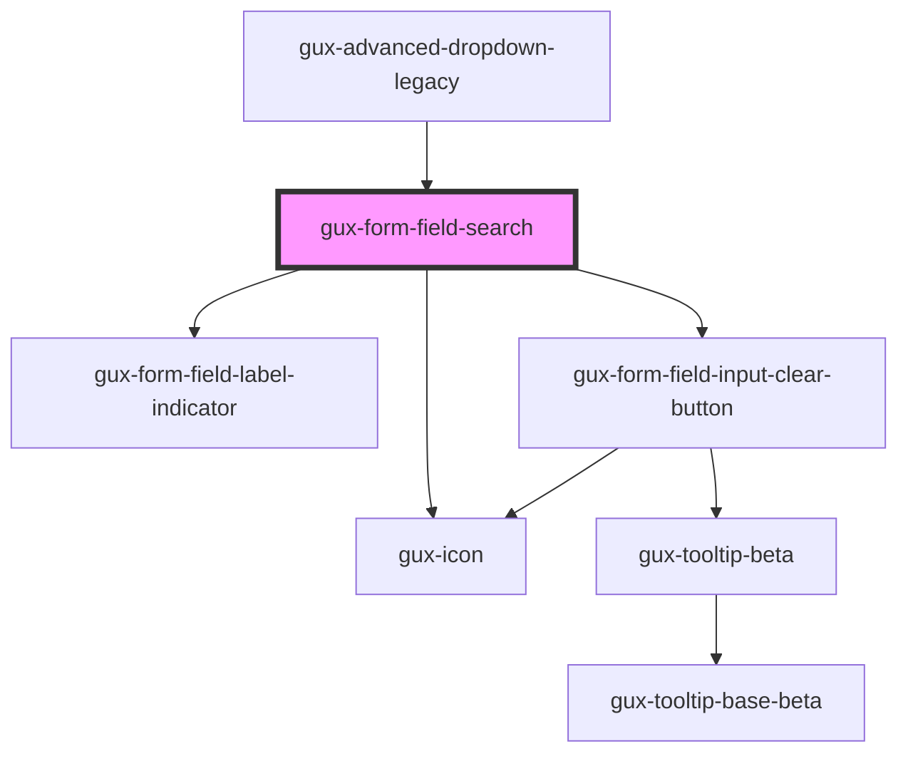

# gux-form-field-search

<!-- Auto Generated Below -->

## Properties

| Property        | Attribute        | Description                                                                                                                                                                                                                                                                     | Type                                    | Default      |
| --------------- | ---------------- | ------------------------------------------------------------------------------------------------------------------------------------------------------------------------------------------------------------------------------------------------------------------------------- | --------------------------------------- | ------------ |
| `indicatorMark` | `indicator-mark` | Field indicator mark which can show *, (optional) or blank Defaults to required. When set to required, the component will display * for required fields and blank for optional When set to optional, the component will display (optional) for optional and blank for required. | `"none" \| "optional" \| "required"`    | `'required'` |
| `labelPosition` | `label-position` |                                                                                                                                                                                                                                                                                 | `"above" \| "beside" \| "screenreader"` | `undefined`  |

## Methods

### `guxForceUpdate() => Promise<void>`

#### Returns

Type: `Promise<void>`

## Slots

| Slot           | Description                     |
| -------------- | ------------------------------- |
| `"error"`      | Optional slot for error message |
| `"help"`       | Optional slot for help message  |
| `"input"`      | Required slot for input tag     |
| `"label"`      | Required slot for label tag     |
| `"label-info"` | Optional slot for label tooltip |

## Dependencies

### Used by

 - [gux-advanced-dropdown-legacy](../../../../legacy/gux-advanced-dropdown-legacy)

### Depends on

- [gux-form-field-label-indicator](../../helper-components/gux-form-field-label-indicator)
- [gux-icon](../../../gux-icon)
- [gux-form-field-input-clear-button](../../helper-components/gux-form-field-input-clear-button)

### Graph

----------------------------------------------

*Built with [StencilJS](https://stenciljs.com/)*
