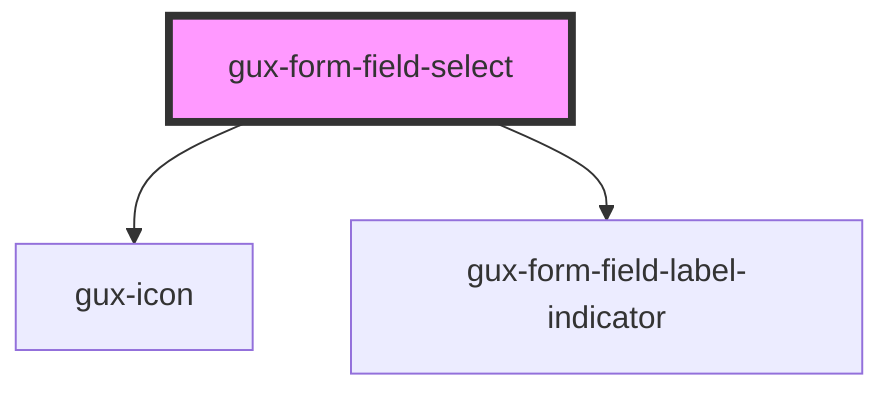

# gux-form-field-select

<!-- Auto Generated Below -->

## Properties

| Property        | Attribute        | Description                                                                                                                                                                                                                                                                     | Type                                    | Default     |
| --------------- | ---------------- | ------------------------------------------------------------------------------------------------------------------------------------------------------------------------------------------------------------------------------------------------------------------------------- | --------------------------------------- | ----------- |
| `indicatorMark` | `indicator-mark` | Field indicator mark which can show *, (optional) or blank Defaults to required. When set to required, the component will display * for required fields and blank for optional When set to optional, the component will display (optional) for optional and blank for required. | `"optional" \| "required"`              | `undefined` |
| `labelPosition` | `label-position` |                                                                                                                                                                                                                                                                                 | `"above" \| "beside" \| "screenreader"` | `undefined` |

## Slots

| Slot      | Description                     |
| --------- | ------------------------------- |
| `"error"` | Optional slot for error message |
| `"help"`  | Optional slot for help message  |
| `"input"` | Required slot for input tag     |
| `"label"` | Required slot for label tag     |

## Dependencies

### Depends on

- [gux-icon](../../../gux-icon)
- [gux-form-field-label-indicator](../../helper-components/gux-form-field-optional-indicator)

### Graph

----------------------------------------------

*Built with [StencilJS](https://stenciljs.com/)*
