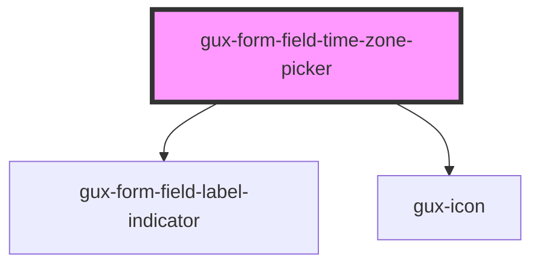

# gux-form-field-time-zone-picker

<!-- Auto Generated Below -->

## Properties

| Property        | Attribute        | Description | Type                                    | Default     |
| --------------- | ---------------- | ----------- | --------------------------------------- | ----------- |
| `labelPosition` | `label-position` |             | `"above" \| "beside" \| "screenreader"` | `undefined` |

## Slots

| Slot                                                | Description                     |
| --------------------------------------------------- | ------------------------------- |
| `"Required slot for gux-time-zone-picker-beta tag"` |                                 |
| `"error"`                                           | Optional slot for error message |
| `"help"`                                            | Optional slot for help message  |
| `"label"`                                           | Required slot for label tag     |
| `"label-info"`                                      | Optional slot for label tooltip |

## Dependencies

### Depends on

- [gux-form-field-label-indicator](../../helper-components/gux-form-field-optional-indicator)
- [gux-icon](../../../gux-icon)

### Graph

----------------------------------------------

*Built with [StencilJS](https://stenciljs.com/)*
