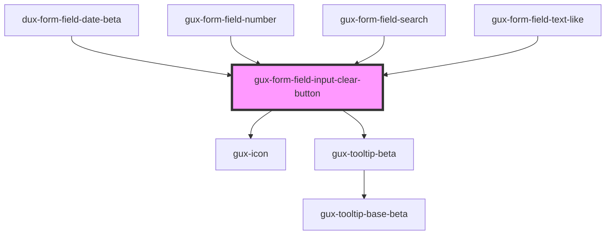

# gux-form-field-input-clear-button

<!-- Auto Generated Below -->

## Dependencies

### Used by

 - [dux-form-field-date-beta](../../components/gux-form-field-date)
 - [gux-form-field-number](../../components/gux-form-field-number)
 - [gux-form-field-search](../../components/gux-form-field-search)
 - [gux-form-field-text-like](../../components/gux-form-field-text-like)

### Depends on

- [gux-icon](../../../gux-icon)
- [gux-tooltip-beta](../../../../beta/gux-tooltip-beta)

### Graph

----------------------------------------------

*Built with [StencilJS](https://stenciljs.com/)*
