# gux-form-field-label-indicator

<!-- Auto Generated Below -->

## Properties

| Property   | Attribute  | Description | Type                       | Default      |
| ---------- | ---------- | ----------- | -------------------------- | ------------ |
| `required` | `required` |             | `boolean`                  | `false`      |
| `variant`  | `variant`  |             | `"optional" \| "required"` | `'required'` |

## Dependencies

### Used by

 - [gux-form-field-color](../../components/gux-form-field-color)
 - [gux-form-field-dropdown](../../components/gux-form-field-dropdown)
 - [gux-form-field-file](../../components/gux-form-field-file)
 - [gux-form-field-number](../../components/gux-form-field-number)
 - [gux-form-field-phone](../../components/gux-form-field-phone)
 - [gux-form-field-range](../../components/gux-form-field-range)
 - [gux-form-field-search](../../components/gux-form-field-search)
 - [gux-form-field-select](../../components/gux-form-field-select)
 - [gux-form-field-text-like](../../components/gux-form-field-text-like)
 - [gux-form-field-textarea](../../components/gux-form-field-textarea)
 - [gux-form-field-time-picker](../../components/gux-form-field-time-picker)
 - [gux-form-field-time-zone-picker](../../components/gux-form-field-time-zone-picker)

### Graph

```mermaid
graph TD;
  gux-form-field-color --> gux-form-field-label-indicator
  gux-form-field-dropdown --> gux-form-field-label-indicator
  gux-form-field-file --> gux-form-field-label-indicator
  gux-form-field-number --> gux-form-field-label-indicator
  gux-form-field-phone --> gux-form-field-label-indicator
  gux-form-field-range --> gux-form-field-label-indicator
  gux-form-field-search --> gux-form-field-label-indicator
  gux-form-field-select --> gux-form-field-label-indicator
  gux-form-field-text-like --> gux-form-field-label-indicator
  gux-form-field-textarea --> gux-form-field-label-indicator
  gux-form-field-time-picker --> gux-form-field-label-indicator
  gux-form-field-time-zone-picker --> gux-form-field-label-indicator
  style gux-form-field-label-indicator fill:#f9f,stroke:#333,stroke-width:4px
```

----------------------------------------------

*Built with [StencilJS](https://stenciljs.com/)*
