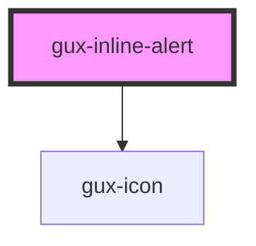

# gux-inline-alert

<!-- Auto Generated Below -->

## Properties

| Property | Attribute | Description | Type                                          | Default  |
| -------- | --------- | ----------- | --------------------------------------------- | -------- |
| `accent` | `accent`  |             | `"error" \| "info" \| "success" \| "warning"` | `'info'` |

## Slots

| Slot | Description       |
| ---- | ----------------- |
|      | Slot for message. |

## CSS Custom Properties

| Name                                     | Description |
| ---------------------------------------- | ----------- |
| `--gse-ui-alert-borderRadius`            |             |
| `--gse-ui-alert-error-backgroundColor`   |             |
| `--gse-ui-alert-error-border-color`      |             |
| `--gse-ui-alert-error-border-style`      |             |
| `--gse-ui-alert-error-border-width`      |             |
| `--gse-ui-alert-error-foregroundColor`   |             |
| `--gse-ui-alert-error-iconColor`         |             |
| `--gse-ui-alert-gap`                     |             |
| `--gse-ui-alert-info-backgroundColor`    |             |
| `--gse-ui-alert-info-border-color`       |             |
| `--gse-ui-alert-info-border-style`       |             |
| `--gse-ui-alert-info-border-width`       |             |
| `--gse-ui-alert-info-foregroundColor`    |             |
| `--gse-ui-alert-info-iconColor`          |             |
| `--gse-ui-alert-padding`                 |             |
| `--gse-ui-alert-success-backgroundColor` |             |
| `--gse-ui-alert-success-border-color`    |             |
| `--gse-ui-alert-success-border-style`    |             |
| `--gse-ui-alert-success-border-width`    |             |
| `--gse-ui-alert-success-foregroundColor` |             |
| `--gse-ui-alert-success-iconColor`       |             |
| `--gse-ui-alert-text-fontFamily`         |             |
| `--gse-ui-alert-text-fontSize`           |             |
| `--gse-ui-alert-text-fontWeight`         |             |
| `--gse-ui-alert-text-lineHeight`         |             |
| `--gse-ui-alert-warning-backgroundColor` |             |
| `--gse-ui-alert-warning-border-color`    |             |
| `--gse-ui-alert-warning-border-style`    |             |
| `--gse-ui-alert-warning-border-width`    |             |
| `--gse-ui-alert-warning-foregroundColor` |             |
| `--gse-ui-alert-warning-iconColor`       |             |

## Dependencies

### Depends on

- [gux-icon](../gux-icon)

### Graph

----------------------------------------------

*Built with [StencilJS](https://stenciljs.com/)*
