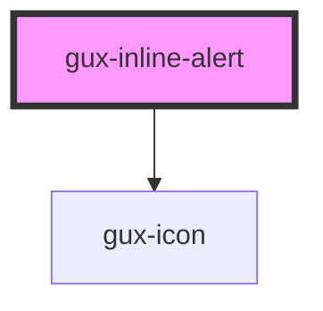

# gux-inline-alert

<!-- Auto Generated Below -->

## Properties

| Property | Attribute | Description | Type                                          | Default  |
| -------- | --------- | ----------- | --------------------------------------------- | -------- |
| `accent` | `accent`  |             | `"error" \| "info" \| "success" \| "warning"` | `'info'` |

## Slots

| Slot | Description       |
| ---- | ----------------- |
|      | Slot for message. |

## Dependencies

### Depends on

- [gux-icon](../gux-icon)

### Graph

----------------------------------------------

*Built with [StencilJS](https://stenciljs.com/)*
