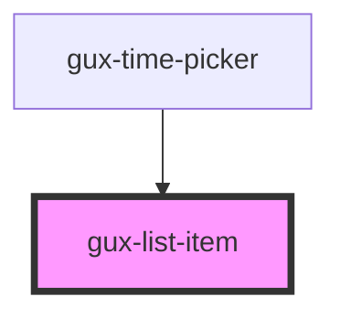

# gux-list-item

<!-- Auto Generated Below -->

## Properties

| Property   | Attribute  | Description | Type      | Default |
| ---------- | ---------- | ----------- | --------- | ------- |
| `disabled` | `disabled` |             | `boolean` | `false` |

## Slots

| Slot | Description |
| ---- | ----------- |
|      | text        |

## Dependencies

### Used by

 - [gux-time-picker](../../gux-time-picker)

### Graph

----------------------------------------------

*Built with [StencilJS](https://stenciljs.com/)*
