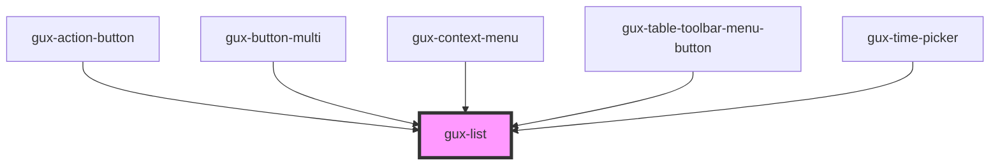

# gux-list

<!-- Auto Generated Below -->

## Methods

### `guxFocusFirstItem() => Promise<void>`

#### Returns

Type: `Promise<void>`

### `guxFocusItemByClosestId(id: string) => Promise<void>`

#### Parameters

| Name | Type     | Description |
| ---- | -------- | ----------- |
| `id` | `string` |             |

#### Returns

Type: `Promise<void>`

### `guxFocusItemById(id: string) => Promise<void>`

#### Parameters

| Name | Type     | Description |
| ---- | -------- | ----------- |
| `id` | `string` |             |

#### Returns

Type: `Promise<void>`

### `guxFocusLastItem() => Promise<void>`

#### Returns

Type: `Promise<void>`

## Dependencies

### Used by

 - [gux-action-button](../gux-action-button)
 - [gux-button-multi](../gux-button-multi)
 - [gux-context-menu](../gux-context-menu)
 - [gux-table-toolbar-menu-button](../gux-table-toolbar/gux-table-toolbar-menu-button)
 - [gux-time-picker](../gux-time-picker)

### Graph

----------------------------------------------

*Built with [StencilJS](https://stenciljs.com/)*
