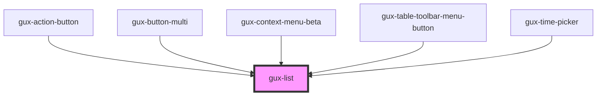

# gux-list

A list element. In order to use this element list contents must be slotted in.

Example usage

```html
<gux-action-list>
  <gux-action-list-item value="test" text="test1" />
  <gux-action-list-divider />
  <gux-action-list-item value="test" text="test2" />
  <gux-action-list-item value="test" text="test3" />
</gux-action-list>
```

Example with slotting

```html
<gux-action-list>
  <gux-action-list-item
    ><span>⌘</span><gux-text-highlight text="test"
  /></gux-action-list-item>
</gux-action-list>
```

<!-- Auto Generated Below -->


## Methods

### `guxFocusFirstItem() => Promise<void>`


#### Returns

Type: `Promise<void>`


### `guxFocusItemByClosestId(id: string) => Promise<void>`


#### Returns

Type: `Promise<void>`


### `guxFocusItemById(id: string) => Promise<void>`


#### Returns

Type: `Promise<void>`


### `guxFocusLastItem() => Promise<void>`


#### Returns

Type: `Promise<void>`


## Dependencies

### Used by

 - [gux-action-button](../gux-action-button)
 - [gux-button-multi](../gux-button-multi)
 - [gux-context-menu-beta](../../beta/gux-context-menu)
 - [gux-table-toolbar-menu-button](../../beta/gux-table-toolbar/gux-table-toolbar-menu-button)
 - [gux-time-picker](../gux-time-picker)

### Graph


----------------------------------------------

*Built with [StencilJS](https://stenciljs.com/)*
