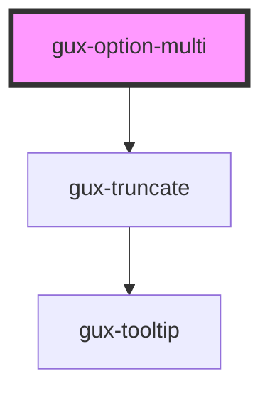

# gux-option-multi

<!-- Auto Generated Below -->

## Properties

| Property   | Attribute  | Description | Type      | Default     |
| ---------- | ---------- | ----------- | --------- | ----------- |
| `active`   | `active`   |             | `boolean` | `false`     |
| `custom`   | `custom`   |             | `boolean` | `false`     |
| `disabled` | `disabled` |             | `boolean` | `false`     |
| `filtered` | `filtered` |             | `boolean` | `false`     |
| `selected` | `selected` |             | `boolean` | `false`     |
| `subtext`  | `subtext`  |             | `string`  | `undefined` |
| `value`    | `value`    |             | `string`  | `undefined` |

## Events

| Event                        | Description | Type                  |
| ---------------------------- | ----------- | --------------------- |
| `guxremovecustomoption`      |             | `CustomEvent<string>` |
| `internalselectcustomoption` |             | `CustomEvent<string>` |

## Slots

| Slot | Description |
| ---- | ----------- |
|      | text        |

## Dependencies

### Depends on

- [gux-truncate](../../gux-truncate)

### Graph

----------------------------------------------

*Built with [StencilJS](https://stenciljs.com/)*
