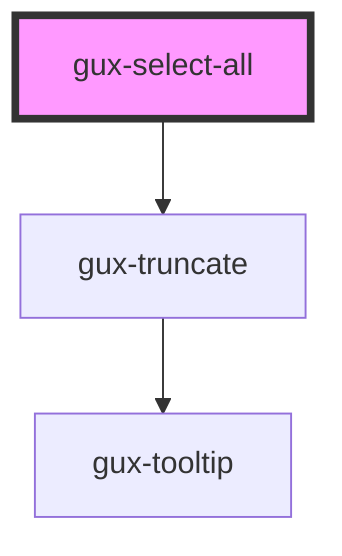

# gux-select-all

<!-- Auto Generated Below -->

## Properties

| Property        | Attribute       | Description | Type      | Default |
| --------------- | --------------- | ----------- | --------- | ------- |
| `active`        | `active`        |             | `boolean` | `false` |
| `indeterminate` | `indeterminate` |             | `boolean` | `false` |
| `selected`      | `selected`      |             | `boolean` | `false` |

## Slots

| Slot | Description    |
| ---- | -------------- |
|      | slot for text. |

## Dependencies

### Depends on

- [gux-truncate](../../gux-truncate)

### Graph

----------------------------------------------

*Built with [StencilJS](https://stenciljs.com/)*
