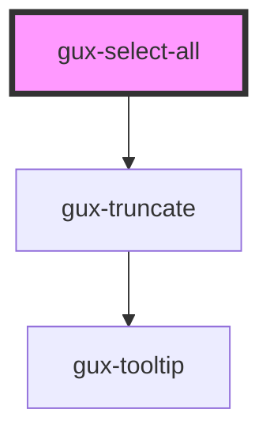

# gux-select-all

<!-- Auto Generated Below -->

## Properties

| Property        | Attribute       | Description | Type      | Default |
| --------------- | --------------- | ----------- | --------- | ------- |
| `indeterminate` | `indeterminate` |             | `boolean` | `false` |
| `selected`      | `selected`      |             | `boolean` | `false` |

## Dependencies

### Depends on

- [gux-truncate](../../gux-truncate)

### Graph

```mermaid
graph TD;
  gux-select-all --> gux-truncate
  gux-truncate --> gux-tooltip
  style gux-select-all fill:#f9f,stroke:#333,stroke-width:4px
```

----------------------------------------------

*Built with [StencilJS](https://stenciljs.com/)*
