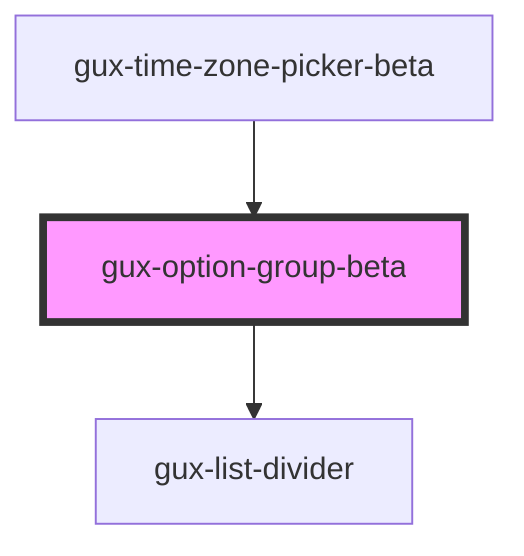

# gux-option-group

<!-- Auto Generated Below -->

## Properties

| Property             | Attribute | Description | Type     | Default     |
| -------------------- | --------- | ----------- | -------- | ----------- |
| `label` _(required)_ | `label`   |             | `string` | `undefined` |

## Slots

| Slot | Description                                                             |
| ---- | ----------------------------------------------------------------------- |
|      | collection of elements conforming to the ListboxOptionElement interface |

## Dependencies

### Used by

 - [gux-time-zone-picker-beta](../../../beta/gux-time-zone-picker)

### Depends on

- [gux-list-divider](../../gux-list/gux-list-divider)

### Graph

----------------------------------------------

*Built with [StencilJS](https://stenciljs.com/)*
