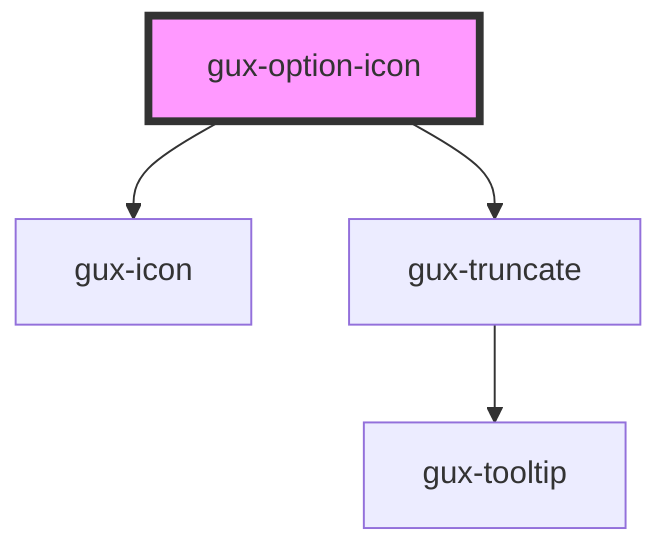

# gux-option-icon

<!-- Auto Generated Below -->

## Properties

| Property       | Attribute       | Description | Type               | Default     |
| -------------- | --------------- | ----------- | ------------------ | ----------- |
| `active`       | `active`        |             | `boolean`          | `false`     |
| `disabled`     | `disabled`      |             | `boolean`          | `false`     |
| `filtered`     | `filtered`      |             | `boolean`          | `false`     |
| `hovered`      | `hovered`       |             | `boolean`          | `false`     |
| `iconColor`    | `icon-color`    |             | `string`           | `undefined` |
| `iconName`     | `icon-name`     |             | `string`           | `undefined` |
| `iconPosition` | `icon-position` |             | `"end" \| "start"` | `'start'`   |
| `iconSrText`   | `icon-sr-text`  |             | `string`           | `undefined` |
| `selected`     | `selected`      |             | `boolean`          | `false`     |
| `value`        | `value`         |             | `string`           | `undefined` |

## Slots

| Slot        | Description               |
| ----------- | ------------------------- |
|             | text                      |
| `"subtext"` | Optional slot for subtext |

## Dependencies

### Depends on

- [gux-icon](../../../gux-icon)
- [gux-truncate](../../../gux-truncate)

### Graph

----------------------------------------------

*Built with [StencilJS](https://stenciljs.com/)*
