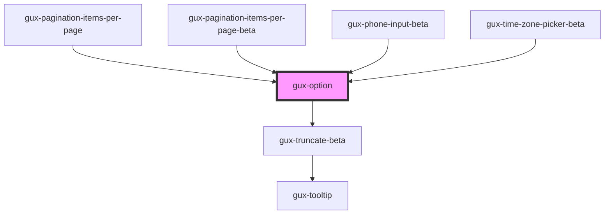

# gux-option

<!-- Auto Generated Below -->

## Properties

| Property   | Attribute  | Description | Type      | Default     |
| ---------- | ---------- | ----------- | --------- | ----------- |
| `active`   | `active`   |             | `boolean` | `false`     |
| `disabled` | `disabled` |             | `boolean` | `false`     |
| `filtered` | `filtered` |             | `boolean` | `false`     |
| `hovered`  | `hovered`  |             | `boolean` | `false`     |
| `selected` | `selected` |             | `boolean` | `false`     |
| `value`    | `value`    |             | `string`  | `undefined` |

## Slots

| Slot | Description |
| ---- | ----------- |
|      | text        |

## Dependencies

### Used by

 - [gux-pagination-items-per-page](../../../gux-pagination/gux-pagination-items-per-page)
 - [gux-pagination-items-per-page-beta](../../../../beta/gux-pagination-beta/gux-pagination-items-per-page-beta)
 - [gux-phone-input-beta](../../../../beta/gux-phone-input)
 - [gux-time-zone-picker-beta](../../../../beta/gux-time-zone-picker)

### Depends on

- [gux-truncate-beta](../../../../beta/gux-truncate)

### Graph

----------------------------------------------

*Built with [StencilJS](https://stenciljs.com/)*
