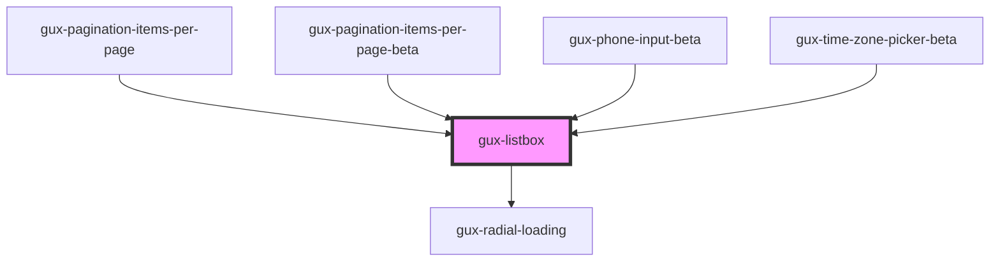

# gux-listbox

<!-- Auto Generated Below -->

## Overview

The listbox component provides keyboard bindings and a11y patterns for selecting
from a list of options.

## Properties

| Property     | Attribute     | Description | Type                                  | Default     |
| ------------ | ------------- | ----------- | ------------------------------------- | ----------- |
| `filter`     | `filter`      |             | `string`                              | `''`        |
| `filterType` | `filter-type` |             | `"custom" \| "none" \| "starts-with"` | `'none'`    |
| `loading`    | `loading`     |             | `boolean`                             | `false`     |
| `value`      | `value`       |             | `string`                              | `undefined` |

## Events

| Event                           | Description | Type               |
| ------------------------------- | ----------- | ------------------ |
| `internallistboxoptionsupdated` |             | `CustomEvent<any>` |

## Methods

### `guxSelectActive() => Promise<void>`

#### Returns

Type: `Promise<void>`

## Slots

| Slot | Description                                                             |
| ---- | ----------------------------------------------------------------------- |
|      | collection of elements conforming to the ListboxOptionElement interface |

## Dependencies

### Used by

 - [gux-pagination-items-per-page](../gux-pagination/gux-pagination-items-per-page)
 - [gux-pagination-items-per-page-beta](../../beta/gux-pagination-beta/gux-pagination-items-per-page-beta)
 - [gux-phone-input-beta](../../beta/gux-phone-input)
 - [gux-time-zone-picker-beta](../../beta/gux-time-zone-picker)

### Depends on

- [gux-radial-loading](../gux-radial-loading)

### Graph

----------------------------------------------

*Built with [StencilJS](https://stenciljs.com/)*
