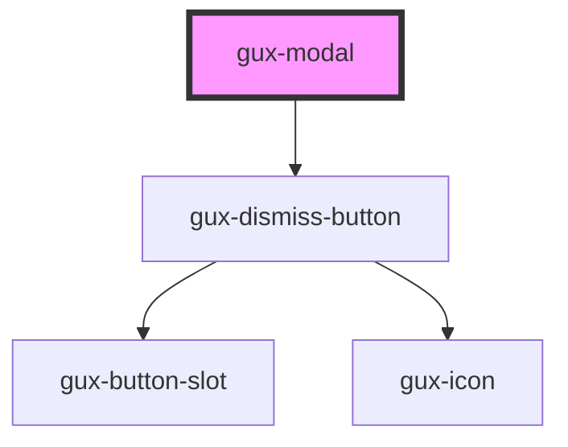

# gux-modal

<!-- Auto Generated Below -->

## Properties

| Property | Attribute | Description                                                                                                                                                                                                                                                                                                                                          | Type                                          | Default     |
| -------- | --------- | ---------------------------------------------------------------------------------------------------------------------------------------------------------------------------------------------------------------------------------------------------------------------------------------------------------------------------------------------------- | --------------------------------------------- | ----------- |
| `open`   | `open`    | Indicates/sets whether or not the modal is open. On a native dialog, you should not toggle the open attribute, due to the unusual behaviors described [here](https://html.spec.whatwg.org/multipage/interactive-elements.html#attr-dialog-open) In this component, it is safe as this property acts as a proxy for calls to `showModal` and `close`. | `boolean`                                     | `false`     |
| `size`   | `size`    | Indicates the size of the modal (small, medium or large)                                                                                                                                                                                                                                                                                             | `"dynamic" \| "large" \| "medium" \| "small"` | `'dynamic'` |

## Events

| Event        | Description                           | Type                |
| ------------ | ------------------------------------- | ------------------- |
| `guxdismiss` | Fired when a user dismisses the modal | `CustomEvent<void>` |

## Methods

### `close() => Promise<void>`

#### Returns

Type: `Promise<void>`

### `showModal() => Promise<void>`

#### Returns

Type: `Promise<void>`

## Dependencies

### Depends on

- [gux-dismiss-button](../gux-dismiss-button)

### Graph

----------------------------------------------

*Built with [StencilJS](https://stenciljs.com/)*
