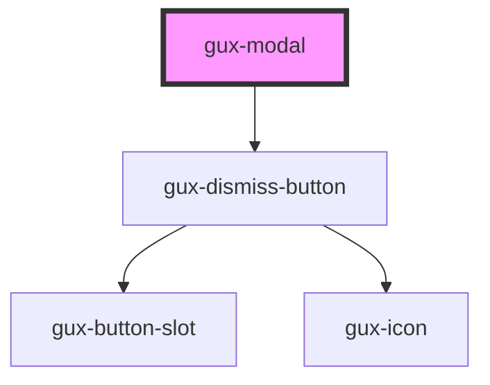

# gux-modal

<!-- Auto Generated Below -->

## Properties

| Property | Attribute | Description                                              | Type                                          | Default     |
| -------- | --------- | -------------------------------------------------------- | --------------------------------------------- | ----------- |
| `size`   | `size`    | Indicates the size of the modal (small, medium or large) | `"dynamic" \| "large" \| "medium" \| "small"` | `'dynamic'` |

## Events

| Event        | Description                           | Type                |
| ------------ | ------------------------------------- | ------------------- |
| `guxdismiss` | Fired when a user dismisses the modal | `CustomEvent<void>` |

## Methods

### `hideModal() => Promise<void>`

#### Returns

Type: `Promise<void>`

### `showModal() => Promise<void>`

#### Returns

Type: `Promise<void>`

## Dependencies

### Depends on

- [gux-dismiss-button](../gux-dismiss-button)

### Graph

----------------------------------------------

*Built with [StencilJS](https://stenciljs.com/)*
