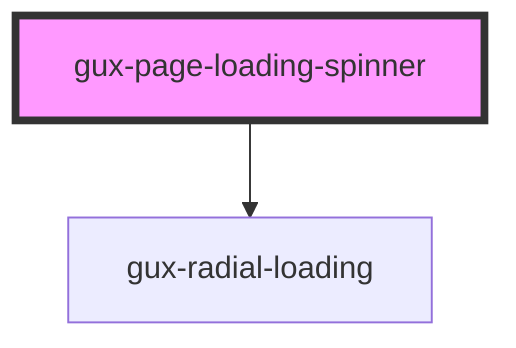

# gux-page-loading-spinner

A simple loading spinner for loading pages.

<!-- Auto Generated Below -->

## Properties

| Property           | Attribute           | Description                                                                                                                                                  | Type     | Default     |
| ------------------ | ------------------- | ------------------------------------------------------------------------------------------------------------------------------------------------------------ | -------- | ----------- |
| `screenreaderText` | `screenreader-text` | Localized text to provide an accessible label for the component. If no screenreader text is provided, the localized string "Loading" will be used by default | `string` | `undefined` |

## Dependencies

### Depends on

- [gux-radial-loading](../gux-radial-loading)

### Graph

----------------------------------------------

*Built with [StencilJS](https://stenciljs.com/)*
