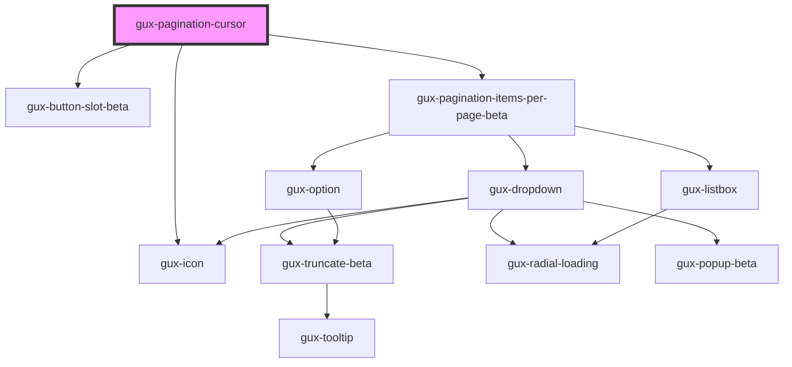

# gux-pagination-cursor

<!-- Auto Generated Below -->

## Properties

| Property       | Attribute        | Description                                                                                    | Type                     | Default     |
| -------------- | ---------------- | ---------------------------------------------------------------------------------------------- | ------------------------ | ----------- |
| `hasNext`      | `has-next`       |                                                                                                | `boolean`                | `false`     |
| `hasPrevious`  | `has-previous`   |                                                                                                | `boolean`                | `false`     |
| `itemsPerPage` | `items-per-page` | Optional. Shows items per page dropdown when set. Only available with layout set to 'advanced' | `100 \| 25 \| 50 \| 75`  | `undefined` |
| `layout`       | `layout`         |                                                                                                | `"advanced" \| "simple"` | `'simple'`  |

## Events

| Event                       | Description | Type                                |
| --------------------------- | ----------- | ----------------------------------- |
| `guxitemsperpagechange`     |             | `CustomEvent<number>`               |
| `guxPaginationCursorchange` |             | `CustomEvent<"next" \| "previous">` |

## Dependencies

### Depends on

- [gux-button-slot-beta](../../beta/gux-button-slot)
- [gux-icon](../gux-icon)
- [gux-pagination-items-per-page-beta](../../beta/gux-pagination-beta/gux-pagination-items-per-page-beta)

### Graph

----------------------------------------------

*Built with [StencilJS](https://stenciljs.com/)*
