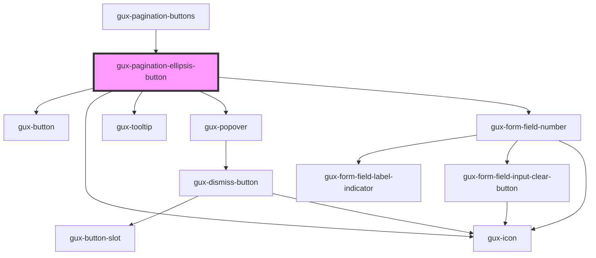

# gux-pagination-ellipsis-button

<!-- Auto Generated Below -->

## Properties

| Property     | Attribute     | Description | Type      | Default     |
| ------------ | ------------- | ----------- | --------- | ----------- |
| `disabled`   | `disabled`    |             | `boolean` | `false`     |
| `totalPages` | `total-pages` |             | `number`  | `undefined` |

## Events

| Event      | Description | Type                  |
| ---------- | ----------- | --------------------- |
| `goToPage` |             | `CustomEvent<string>` |

## Dependencies

### Used by

 - [gux-pagination-buttons](..)

### Depends on

- [gux-button](../../../gux-button)
- [gux-icon](../../../gux-icon)
- [gux-tooltip](../../../gux-tooltip)
- [gux-popover](../../../gux-popover)
- [gux-form-field-number](../../../gux-form-field/components/gux-form-field-number)

### Graph

----------------------------------------------

*Built with [StencilJS](https://stenciljs.com/)*
