# gux-popup

<!-- Auto Generated Below -->

## Properties

| Property            | Attribute             | Description                                                            | Type                                                                                                                                                                 | Default          |
| ------------------- | --------------------- | ---------------------------------------------------------------------- | -------------------------------------------------------------------------------------------------------------------------------------------------------------------- | ---------------- |
| `disabled`          | `disabled`            |                                                                        | `boolean`                                                                                                                                                            | `false`          |
| `exceedTargetWidth` | `exceed-target-width` | set if parent component design allows for popup exceeding target width | `boolean`                                                                                                                                                            | `false`          |
| `expanded`          | `expanded`            |                                                                        | `boolean`                                                                                                                                                            | `false`          |
| `offset`            | `offset`              | Number of pixels the popup is offset from the target.                  | `number`                                                                                                                                                             | `2`              |
| `placement`         | `placement`           | Placement of the popup. Default is bottom-start                        | `"bottom" \| "bottom-end" \| "bottom-start" \| "left" \| "left-end" \| "left-start" \| "right" \| "right-end" \| "right-start" \| "top" \| "top-end" \| "top-start"` | `'bottom-start'` |

## Events

| Event               | Description                                                          | Type                |
| ------------------- | -------------------------------------------------------------------- | ------------------- |
| `internalcollapsed` | This event will run when the popup transitions to a collapsed state. | `CustomEvent<void>` |
| `internalexpanded`  | This event will run when the popup transitions to an expanded state. | `CustomEvent<void>` |

## Slots

| Slot       | Description              |
| ---------- | ------------------------ |
| `"popup"`  | Required slot for popup  |
| `"target"` | Required slot for target |

## Dependencies

### Used by

 - [gux-action-button](../gux-action-button)
 - [gux-advanced-dropdown-legacy](../../legacy/gux-advanced-dropdown-legacy)
 - [gux-button-multi](../gux-button-multi)
 - [gux-context-menu](../gux-context-menu)
 - [gux-dropdown](../gux-dropdown)
 - [gux-dropdown-multi](../gux-dropdown-multi)
 - [gux-month-picker-beta](../../beta/gux-month-picker)
 - [gux-phone-input-beta](../../beta/gux-phone-input)
 - [gux-rich-text-editor-action-rich-style](../../beta/gux-rich-text-editor/gux-rich-text-editor-action/gux-rich-text-editor-action-rich-style)
 - [gux-rich-text-editor-action-text-highlight](../../beta/gux-rich-text-editor/gux-rich-text-editor-action/gux-rich-text-editor-action-text-highlight)
 - [gux-rich-text-editor-menu](../../beta/gux-rich-text-editor/gux-rich-text-editor-menu)
 - [gux-table-toolbar-menu-button](../gux-table-toolbar/gux-table-toolbar-menu-button)
 - [gux-time-picker](../gux-time-picker)

### Graph

```mermaid
graph TD;
  gux-action-button --> gux-popup
  gux-advanced-dropdown-legacy --> gux-popup
  gux-button-multi --> gux-popup
  gux-context-menu --> gux-popup
  gux-dropdown --> gux-popup
  gux-dropdown-multi --> gux-popup
  gux-month-picker-beta --> gux-popup
  gux-phone-input-beta --> gux-popup
  gux-rich-text-editor-action-rich-style --> gux-popup
  gux-rich-text-editor-action-text-highlight --> gux-popup
  gux-rich-text-editor-menu --> gux-popup
  gux-table-toolbar-menu-button --> gux-popup
  gux-time-picker --> gux-popup
  style gux-popup fill:#f9f,stroke:#333,stroke-width:4px
```

----------------------------------------------

*Built with [StencilJS](https://stenciljs.com/)*
