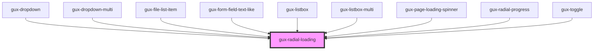

# gux-radial-loading

When the loading of a task is known, this component displays a radial indicator and the completed percentage of
the task.

Otherwise, if the loading is unknown, and no percentage is provided, it instead displays a simple Loading Spinner.

<!-- Auto Generated Below -->

## Properties

| Property           | Attribute           | Description                                                                                                                                                   | Type                                | Default   |
| ------------------ | ------------------- | ------------------------------------------------------------------------------------------------------------------------------------------------------------- | ----------------------------------- | --------- |
| `context`          | `context`           | The display context the component is in.                                                                                                                      | `"full-page" \| "input" \| "modal"` | `'modal'` |
| `screenreaderText` | `screenreader-text` | Localized text to provide an accessible label for the component. If no screenreader text is provided, the localized string "Loading" will be used by default. | `string`                            | `''`      |

## Dependencies

### Used by

 - [gux-dropdown](../gux-dropdown)
 - [gux-dropdown-multi](../gux-dropdown-multi)
 - [gux-file-list-item](../gux-form-field/components/gux-form-field-file-beta/components/gux-file-list-item)
 - [gux-form-field-text-like](../gux-form-field/components/gux-form-field-text-like)
 - [gux-listbox](../gux-listbox)
 - [gux-listbox-multi](../gux-listbox-multi)
 - [gux-page-loading-spinner](../gux-page-loading-spinner)
 - [gux-radial-progress](../gux-radial-progress)
 - [gux-toggle](../gux-toggle)

### Graph

----------------------------------------------

*Built with [StencilJS](https://stenciljs.com/)*
