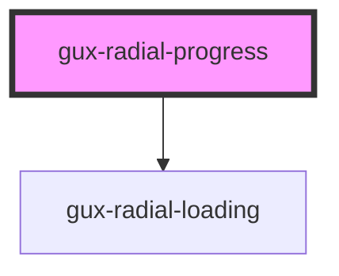

# gux-radial-progress

When the progress of a task is known, this component displays a radial indicator and the completed percentage of 
the task.

Otherwise, if the progress is unknown, and no percentage is provided, it instead displays a simple Loading Spinner.

<!-- Auto Generated Below -->

## Properties

| Property           | Attribute           | Description                                                              | Type     | Default     |
| ------------------ | ------------------- | ------------------------------------------------------------------------ | -------- | ----------- |
| `max`              | `max`               | The max value of the progress spinner                                    | `number` | `100`       |
| `screenreaderText` | `screenreader-text` | Required localized text to provide an accessible label for the component | `string` | `''`        |
| `value`            | `value`             | The progress made in the progress spinner compared to the max value      | `number` | `undefined` |

## CSS Custom Properties

| Name                                                  | Description                                            |
| ----------------------------------------------------- | ------------------------------------------------------ |
| `--gse-ui-progressAndLoading-largeBorder`             | //TODO https://inindca.atlassian.net/browse/COMUI-2226 |
| `--gse-ui-progressAndLoading-largeBorder-0`           | //TODO https://inindca.atlassian.net/browse/COMUI-2226 |
| `--gse-ui-progressAndLoading-largeBorder-1`           | //TODO https://inindca.atlassian.net/browse/COMUI-2226 |
| `--gse-ui-progressAndLoading-largeBorder-2`           | //TODO https://inindca.atlassian.net/browse/COMUI-2226 |
| `--gse-ui-progressAndLoading-spinner-base`            |                                                        |
| `--gse-ui-progressAndLoading-spinner-foreground`      |                                                        |
| `--gse-ui-progressAndLoading-spinner-large`           | //TODO https://inindca.atlassian.net/browse/COMUI-2226 |
| `--gse-ui-progressAndLoading-spinner-text-fontFamily` |                                                        |
| `--gse-ui-progressAndLoading-spinner-text-fontSize`   |                                                        |
| `--gse-ui-progressAndLoading-spinner-text-fontWeight` |                                                        |
| `--gse-ui-progressAndLoading-spinner-text-lineHeight` |                                                        |
| `--gse-ui-progressAndLoading-textColor`               |                                                        |

## Dependencies

### Depends on

- [gux-radial-loading](../gux-radial-loading)

### Graph

----------------------------------------------

*Built with [StencilJS](https://stenciljs.com/)*
