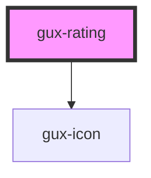

# gux-rating

## Native Events

| Event    | Description | Type               |
| -------- | ----------- | ------------------ |
| `change` |             | `InputEvent`       |
| `input`  |             | `InputEvent`       |

<!-- Auto Generated Below -->

## Properties

| Property   | Attribute   | Description | Type      | Default |
| ---------- | ----------- | ----------- | --------- | ------- |
| `disabled` | `disabled`  |             | `boolean` | `false` |
| `maxValue` | `max-value` |             | `number`  | `5`     |
| `readonly` | `readonly`  |             | `boolean` | `false` |
| `value`    | `value`     |             | `number`  | `0`     |

## Dependencies

### Depends on

- [gux-icon](../gux-icon)

### Graph

----------------------------------------------

*Built with [StencilJS](https://stenciljs.com/)*
