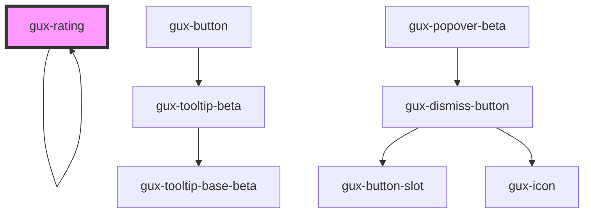

# gux-rating

## Native Events

| Event    | Description | Type               |
| -------- | ----------- | ------------------ |
| `change` |             | `InputEvent`       |
| `input`  |             | `InputEvent`       |

<!-- Auto Generated Below -->

## Properties

| Property    | Attribute   | Description | Type                  | Default     |
| ----------- | ----------- | ----------- | --------------------- | ----------- |
| `compact`   | `compact`   |             | `boolean`             | `false`     |
| `disabled`  | `disabled`  |             | `boolean`             | `false`     |
| `increment` | `increment` |             | `"default" \| "half"` | `'default'` |
| `maxValue`  | `max-value` |             | `number`              | `5`         |
| `readonly`  | `readonly`  |             | `boolean`             | `false`     |
| `value`     | `value`     |             | `number`              | `0`         |

## Dependencies

### Used by

 - [gux-rating](.)

### Depends on

- [gux-icon](../gux-icon)
- [gux-button](../gux-button)
- [gux-popover-beta](../../beta/gux-popover-beta)
- [gux-rating](.)

### Graph

----------------------------------------------

*Built with [StencilJS](https://stenciljs.com/)*
