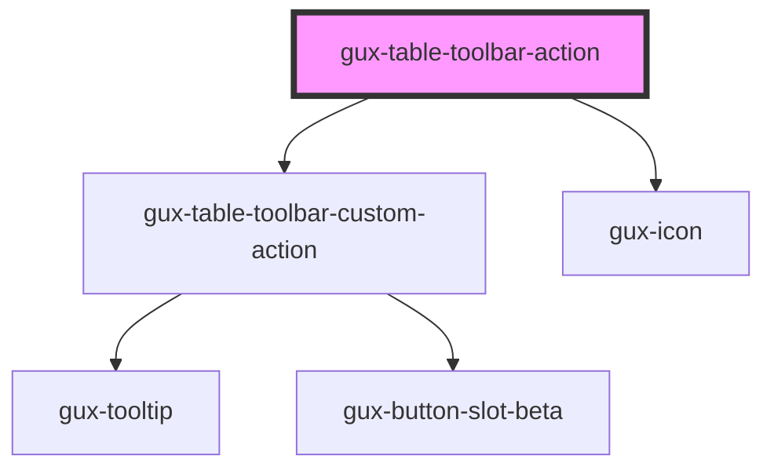

# gux-table-toolbar-action

<!-- Auto Generated Below -->

## Properties

| Property   | Attribute   | Description | Type                                                                 | Default       |
| ---------- | ----------- | ----------- | -------------------------------------------------------------------- | ------------- |
| `accent`   | `accent`    |             | `"ghost" \| "primary" \| "secondary"`                                | `'secondary'` |
| `action`   | `action`    |             | `"add" \| "delete" \| "export" \| "import" \| "refresh" \| "revert"` | `undefined`   |
| `disabled` | `disabled`  |             | `boolean`                                                            | `false`       |
| `iconOnly` | `icon-only` |             | `boolean`                                                            | `false`       |

## Dependencies

### Depends on

- [gux-table-toolbar-custom-action](../gux-table-toolbar-custom-action)
- [gux-icon](../../gux-icon)

### Graph

----------------------------------------------

*Built with [StencilJS](https://stenciljs.com/)*
