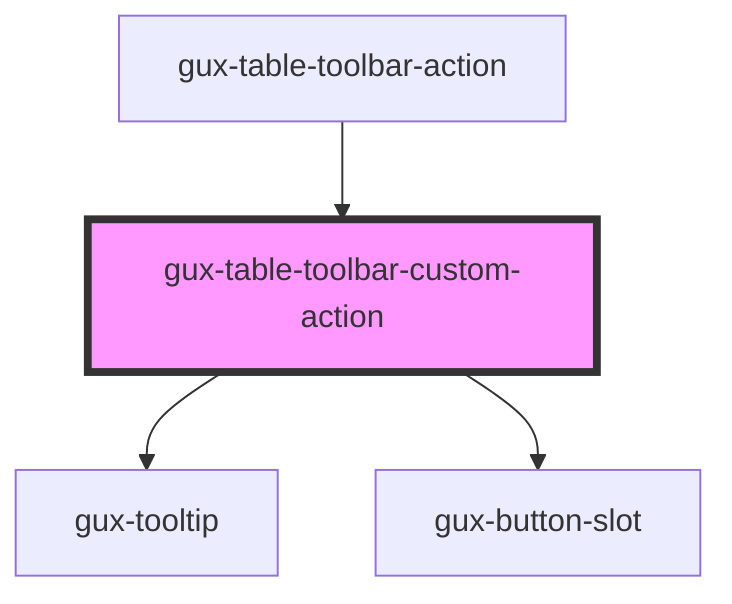

# gux-table-toolbar-custom-action

<!-- Auto Generated Below -->

## Properties

| Property   | Attribute   | Description | Type                                  | Default       |
| ---------- | ----------- | ----------- | ------------------------------------- | ------------- |
| `accent`   | `accent`    |             | `"ghost" \| "primary" \| "secondary"` | `'secondary'` |
| `disabled` | `disabled`  |             | `boolean`                             | `false`       |
| `iconOnly` | `icon-only` |             | `boolean`                             | `false`       |

## Slots

| Slot     | Description           |
| -------- | --------------------- |
| `"icon"` | Slot for icon.        |
| `"text"` | Slot for action text. |

## Dependencies

### Used by

 - [gux-table-toolbar-action](../gux-table-toolbar-action)

### Depends on

- [gux-tooltip](../../gux-tooltip)
- [gux-button-slot](../../gux-button-slot)

### Graph

----------------------------------------------

*Built with [StencilJS](https://stenciljs.com/)*
