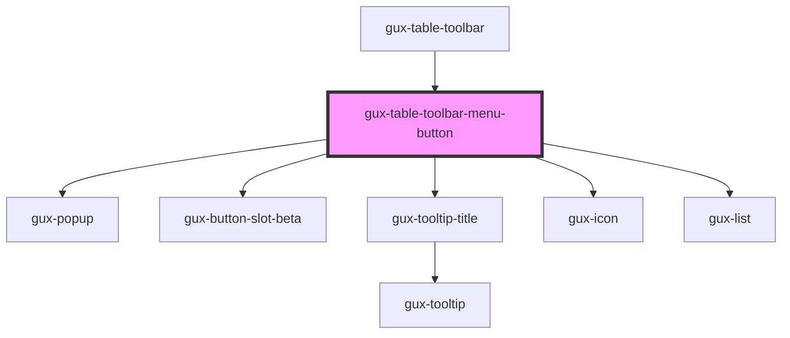

# gux-table-toolbar-menu-button

<!-- Auto Generated Below -->

## Properties

| Property   | Attribute   | Description | Type      | Default     |
| ---------- | ----------- | ----------- | --------- | ----------- |
| `showMenu` | `show-menu` |             | `boolean` | `undefined` |

## Dependencies

### Used by

 - [gux-table-toolbar](..)

### Depends on

- [gux-popup](../../gux-popup)
- [gux-button-slot-beta](../../../beta/gux-button-slot)
- [gux-tooltip-title](../../gux-tooltip-title)
- [gux-icon](../../gux-icon)
- [gux-list](../../gux-list)

### Graph

----------------------------------------------

*Built with [StencilJS](https://stenciljs.com/)*
