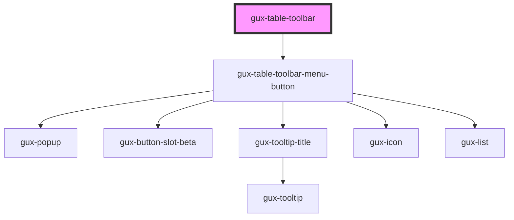

# gux-table-toolbar

<!-- Auto Generated Below -->

## Slots

| Slot                   | Description                  |
| ---------------------- | ---------------------------- |
| `"contextual-actions"` | Slot for contextual actions. |
| `"menu-actions"`       | Slot for menu actions.       |
| `"permanent-actions"`  | Slot for permanent actions.  |
| `"primary-action"`     | Slot for a primary action.   |
| `"search-and-filter"`  | Slot for search and filter.  |

## Dependencies

### Depends on

- [gux-table-toolbar-menu-button](gux-table-toolbar-menu-button)

### Graph

----------------------------------------------

*Built with [StencilJS](https://stenciljs.com/)*
