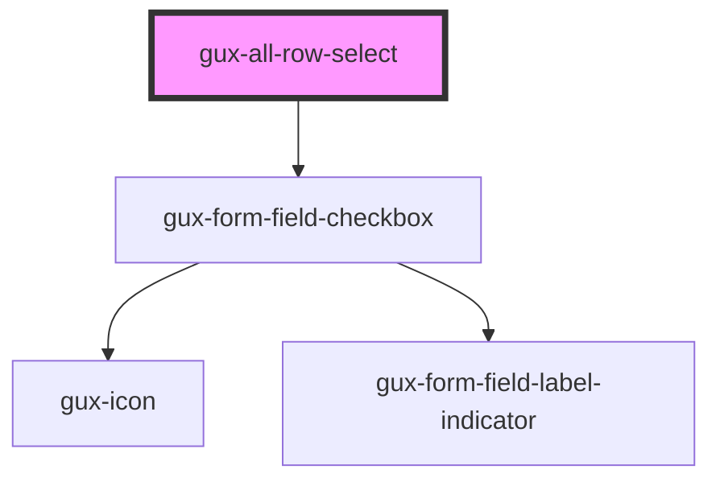

# gux-all-row-select

<!-- Auto Generated Below -->

## Properties

| Property   | Attribute  | Description | Type      | Default     |
| ---------- | ---------- | ----------- | --------- | ----------- |
| `disabled` | `disabled` |             | `boolean` | `undefined` |
| `selected` | `selected` |             | `boolean` | `false`     |

## Events

| Event                        | Description | Type               |
| ---------------------------- | ----------- | ------------------ |
| `internalallrowselectchange` |             | `CustomEvent<any>` |

## Methods

### `setIndeterminate(indeterminate?: boolean) => Promise<void>`

#### Parameters

| Name            | Type      | Description |
| --------------- | --------- | ----------- |
| `indeterminate` | `boolean` |             |

#### Returns

Type: `Promise<void>`

## Dependencies

### Depends on

- [gux-form-field-checkbox](../../gux-form-field/components/gux-form-field-checkbox)

### Graph

----------------------------------------------

*Built with [StencilJS](https://stenciljs.com/)*
