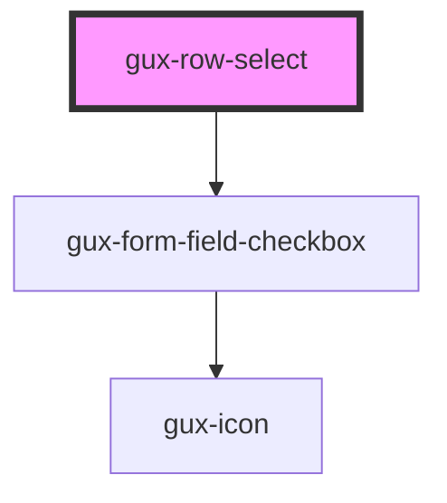

# gux-row-select

<!-- Auto Generated Below -->

## Properties

| Property   | Attribute  | Description | Type      | Default     |
| ---------- | ---------- | ----------- | --------- | ----------- |
| `disabled` | `disabled` |             | `boolean` | `undefined` |
| `label`    | `label`    |             | `string`  | `undefined` |
| `selected` | `selected` |             | `boolean` | `false`     |

## Events

| Event                     | Description | Type               |
| ------------------------- | ----------- | ------------------ |
| `internalrowselectchange` |             | `CustomEvent<any>` |

## Dependencies

### Depends on

- [gux-form-field-checkbox](../../gux-form-field/components/gux-form-field-checkbox)

### Graph

----------------------------------------------

*Built with [StencilJS](https://stenciljs.com/)*
