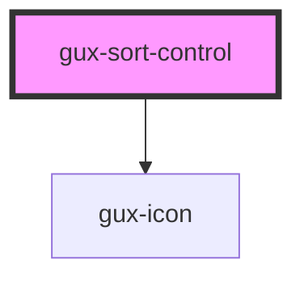

# gux-th

<!-- Auto Generated Below -->

## Properties

| Property          | Attribute          | Description | Type      | Default |
| ----------------- | ------------------ | ----------- | --------- | ------- |
| `includeUnsorted` | `include-unsorted` |             | `boolean` | `false` |

## Events

| Event            | Description | Type                             |
| ---------------- | ----------- | -------------------------------- |
| `guxsortchanged` |             | `CustomEvent<GuxTableSortState>` |

## Dependencies

### Depends on

- [gux-icon](../../gux-icon)

### Graph

----------------------------------------------

*Built with [StencilJS](https://stenciljs.com/)*
