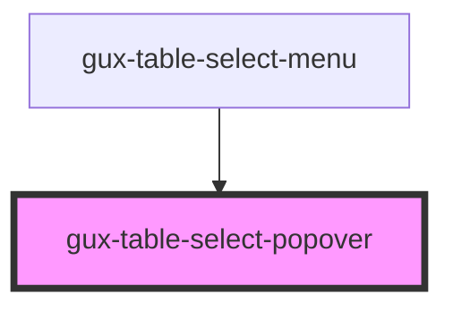

# gux-table-select-popover

<!-- Auto Generated Below -->

## Properties

| Property              | Attribute                | Description                                                  | Type      | Default     |
| --------------------- | ------------------------ | ------------------------------------------------------------ | --------- | ----------- |
| `closeOnClickOutside` | `close-on-click-outside` | Close popover when the user clicks outside of its bounds     | `boolean` | `false`     |
| `for`                 | `for`                    | Indicates the id of the element the popover should anchor to | `string`  | `undefined` |

## Events

| Event        | Description                             | Type                |
| ------------ | --------------------------------------- | ------------------- |
| `guxdismiss` | Fired when a user dismisses the popover | `CustomEvent<void>` |

## Slots

| Slot | Description     |
| ---- | --------------- |
|      | popover content |

## Dependencies

### Used by

 - [gux-table-select-menu](..)

### Graph

----------------------------------------------

*Built with [StencilJS](https://stenciljs.com/)*
