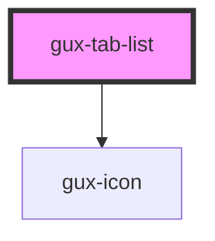

# gux-tab-list

<!-- Auto Generated Below -->

## Methods

### `guxSetActive(activeTab: string) => Promise<void>`

#### Parameters

| Name        | Type     | Description |
| ----------- | -------- | ----------- |
| `activeTab` | `string` |             |

#### Returns

Type: `Promise<void>`

## Dependencies

### Depends on

- [gux-icon](../../gux-icon)

### Graph

----------------------------------------------

*Built with [StencilJS](https://stenciljs.com/)*
