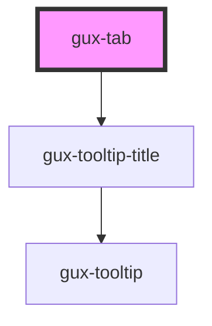

# gux-tabs-list

<!-- Auto Generated Below -->

## Properties

| Property      | Attribute      | Description                  | Type      | Default     |
| ------------- | -------------- | ---------------------------- | --------- | ----------- |
| `guxDisabled` | `gux-disabled` | Specifies if tab is disabled | `boolean` | `false`     |
| `tabId`       | `tab-id`       | Tab id for the tab           | `string`  | `undefined` |

## Events

| Event                      | Description | Type                  |
| -------------------------- | ----------- | --------------------- |
| `internalactivatetabpanel` |             | `CustomEvent<string>` |

## Methods

### `guxFocus() => Promise<void>`

#### Returns

Type: `Promise<void>`

### `guxGetActive() => Promise<boolean>`

#### Returns

Type: `Promise<boolean>`

### `guxSetActive(active: boolean) => Promise<void>`

#### Parameters

| Name     | Type      | Description |
| -------- | --------- | ----------- |
| `active` | `boolean` |             |

#### Returns

Type: `Promise<void>`

## Slots

| Slot | Description |
| ---- | ----------- |
|      | text        |

## Dependencies

### Depends on

- [gux-tooltip-title](../../gux-tooltip-title)

### Graph

----------------------------------------------

*Built with [StencilJS](https://stenciljs.com/)*
