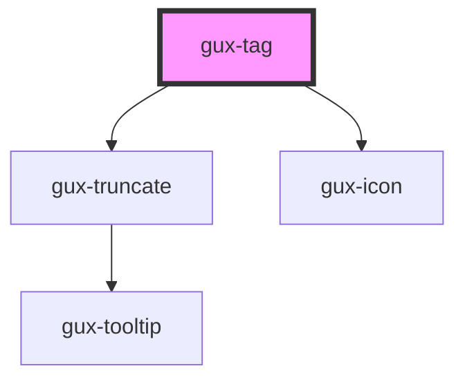

# gux-tag

<!-- Auto Generated Below -->

## Properties

| Property    | Attribute   | Description | Type                                                                                            | Default     |
| ----------- | ----------- | ----------- | ----------------------------------------------------------------------------------------------- | ----------- |
| `accent`    | `accent`    |             | `"1" \| "10" \| "2" \| "3" \| "4" \| "5" \| "6" \| "7" \| "8" \| "9" \| "default" \| "inherit"` | `'default'` |
| `disabled`  | `disabled`  |             | `boolean`                                                                                       | `false`     |
| `removable` | `removable` |             | `boolean`                                                                                       | `false`     |

## Events

| Event       | Description | Type                  |
| ----------- | ----------- | --------------------- |
| `guxdelete` |             | `CustomEvent<string>` |

## Slots

| Slot | Description |
| ---- | ----------- |
|      | content     |

## Dependencies

### Depends on

- [gux-truncate](../gux-truncate)
- [gux-icon](../gux-icon)

### Graph

----------------------------------------------

*Built with [StencilJS](https://stenciljs.com/)*
