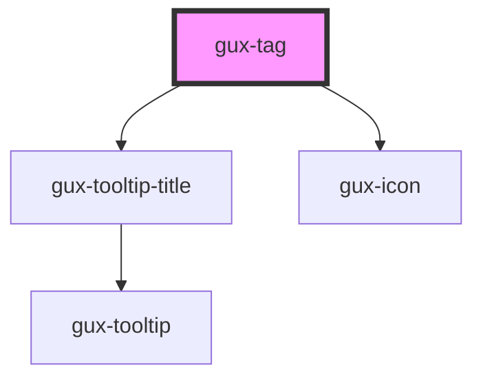

# gux-tag

<!-- Auto Generated Below -->

## Properties

| Property    | Attribute   | Description          | Type                                                                                            | Default     |
| ----------- | ----------- | -------------------- | ----------------------------------------------------------------------------------------------- | ----------- |
| `accent`    | `accent`    |                      | `"1" \| "10" \| "2" \| "3" \| "4" \| "5" \| "6" \| "7" \| "8" \| "9" \| "default" \| "inherit"` | `'default'` |
| `disabled`  | `disabled`  |                      | `boolean`                                                                                       | `false`     |
| `removable` | `removable` |                      | `boolean`                                                                                       | `false`     |
| `value`     | `value`     | Index for remove tag | `string`                                                                                        | `undefined` |

## Events

| Event       | Description | Type                  |
| ----------- | ----------- | --------------------- |
| `guxdelete` |             | `CustomEvent<string>` |

## Slots

| Slot | Description |
| ---- | ----------- |
|      | content     |

## CSS Custom Properties

| Name                                      | Description |
| ----------------------------------------- | ----------- |
| `--gse-ui-tag-accent1-backgroundColor`    |             |
| `--gse-ui-tag-accent1-foregroundColor`    |             |
| `--gse-ui-tag-accent10-backgroundColor`   |             |
| `--gse-ui-tag-accent10-foregroundColor`   |             |
| `--gse-ui-tag-accent2-backgroundColor`    |             |
| `--gse-ui-tag-accent2-foregroundColor`    |             |
| `--gse-ui-tag-accent3-backgroundColor`    |             |
| `--gse-ui-tag-accent3-foregroundColor`    |             |
| `--gse-ui-tag-accent4-backgroundColor`    |             |
| `--gse-ui-tag-accent4-foregroundColor`    |             |
| `--gse-ui-tag-accent5-backgroundColor`    |             |
| `--gse-ui-tag-accent5-foregroundColor`    |             |
| `--gse-ui-tag-accent6-backgroundColor`    |             |
| `--gse-ui-tag-accent6-foregroundColor`    |             |
| `--gse-ui-tag-accent7-backgroundColor`    |             |
| `--gse-ui-tag-accent7-foregroundColor`    |             |
| `--gse-ui-tag-accent8-backgroundColor`    |             |
| `--gse-ui-tag-accent8-foregroundColor`    |             |
| `--gse-ui-tag-accent9-backgroundColor`    |             |
| `--gse-ui-tag-accent9-foregroundColor`    |             |
| `--gse-ui-tag-borderRadius`               |             |
| `--gse-ui-tag-button-size`                |             |
| `--gse-ui-tag-default-backgroundColor`    |             |
| `--gse-ui-tag-default-foregroundColor`    |             |
| `--gse-ui-tag-height`                     |             |
| `--gse-ui-tag-padding`                    |             |
| `--gse-ui-tag-removable-gap`              |             |
| `--gse-ui-tag-removable-padding`          |             |
| `--gse-ui-tag-text-fontFamily`            |             |
| `--gse-ui-tag-text-fontSize`              |             |
| `--gse-ui-tag-text-fontWeight // missing` |             |
| `--gse-ui-tag-text-lineHeight`            |             |

## Dependencies

### Depends on

- [gux-tooltip-title](../gux-tooltip-title)
- [gux-icon](../gux-icon)

### Graph

----------------------------------------------

*Built with [StencilJS](https://stenciljs.com/)*
