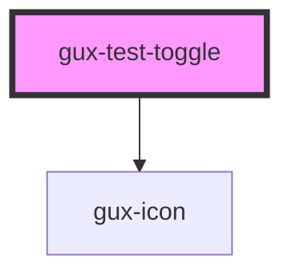

# gux-test-toggle

<!-- Auto Generated Below -->

## Properties

| Property   | Attribute  | Description                               | Type      | Default     |
| ---------- | ---------- | ----------------------------------------- | --------- | ----------- |
| `disabled` | `disabled` | Indicate if the toggle is disabled or not | `boolean` | `false`     |
| `error`    | `error`    | Toggle has error message                  | `boolean` | `false`     |
| `label`    | `label`    | Toggle label                              | `string`  | `undefined` |
| `message`  | `message`  | Toggle message text                       | `string`  | `undefined` |

## Events

| Event           | Description | Type                   |
| --------------- | ----------- | ---------------------- |
| `toggleChecked` |             | `CustomEvent<boolean>` |

## Dependencies

### Depends on

- [gux-icon](../gux-icon)

### Graph

----------------------------------------------

*Built with [StencilJS](https://stenciljs.com/)*
