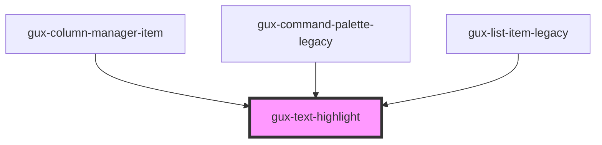

# gux-text-highlight

<!-- Auto Generated Below -->

## Properties

| Property    | Attribute   | Description                             | Type                               | Default     |
| ----------- | ----------- | --------------------------------------- | ---------------------------------- | ----------- |
| `highlight` | `highlight` | The text to highlight.                  | `string`                           | `undefined` |
| `strategy`  | `strategy`  | The way the text should be highlighted. | `"contains" \| "fuzzy" \| "start"` | `'start'`   |
| `text`      | `text`      | The value to display.                   | `string`                           | `undefined` |

## Dependencies

### Used by

 - [gux-column-manager-item](../../beta/gux-column-manager/gux-column-manager-item)
 - [gux-command-palette-legacy](../../legacy/gux-command-palette-legacy)
 - [gux-list-item-legacy](../../legacy/gux-list-legacy/list-item)

### Graph

----------------------------------------------

*Built with [StencilJS](https://stenciljs.com/)*
