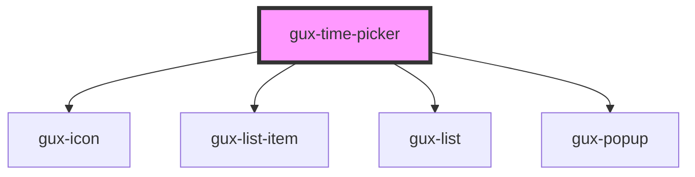

# gux-time-picker

<!-- Auto Generated Below -->

## Properties

| Property    | Attribute    | Description | Type                                   | Default     |
| ----------- | ------------ | ----------- | -------------------------------------- | ----------- |
| `clockType` | `clock-type` |             | `"12h" \| "24h"`                       | `undefined` |
| `disabled`  | `disabled`   |             | `boolean`                              | `false`     |
| `hasError`  | `has-error`  |             | `boolean`                              | `false`     |
| `interval`  | `interval`   |             | `15 \| 30 \| 60`                       | `60`        |
| `max`       | `max`        |             | `string`                               | `undefined` |
| `min`       | `min`        |             | `string`                               | `undefined` |
| `required`  | `required`   |             | `boolean`                              | `false`     |
| `step`      | `step`       |             | `1 \| 10 \| 15 \| 20 \| 30 \| 5 \| 60` | `1`         |
| `value`     | `value`      |             | `` `${string}:${string}` ``            | `'00:00'`   |

## Dependencies

### Depends on

- [gux-icon](../gux-icon)
- [gux-list-item](../gux-list/gux-list-item)
- [gux-list](../gux-list)
- [gux-popup](../gux-popup)

### Graph

----------------------------------------------

*Built with [StencilJS](https://stenciljs.com/)*
