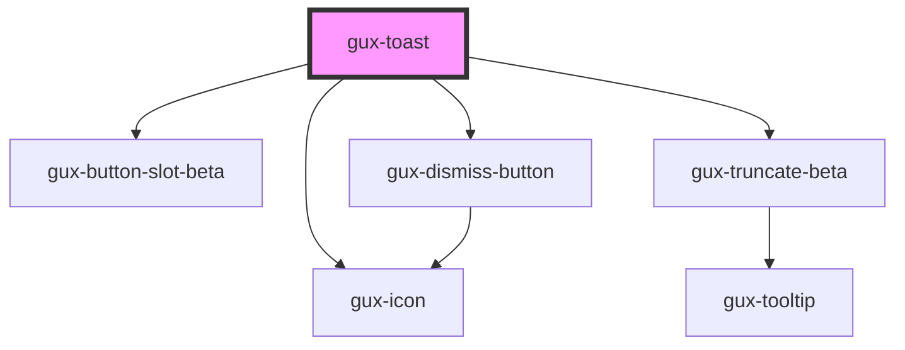

# gux-toast

<!-- Auto Generated Below -->

## Properties

| Property    | Attribute    | Description           | Type                                                      | Default     |
| ----------- | ------------ | --------------------- | --------------------------------------------------------- | ----------- |
| `toastType` | `toast-type` | The component accent. | `"action" \| "error" \| "info" \| "success" \| "warning"` | `'success'` |

## Events

| Event        | Description | Type                |
| ------------ | ----------- | ------------------- |
| `guxdismiss` |             | `CustomEvent<void>` |

## Slots

| Slot         | Description                                                       |
| ------------ | ----------------------------------------------------------------- |
| `"action-1"` | Optional slot for primary action button in the toast              |
| `"action-2"` | Optional slot for secondary action button in the toast            |
| `"icon"`     | Required slot for toast type of action                            |
| `"link"`     | Optional slot for a link in any toast except toast type of action |
| `"message"`  | Required slot for the toast message                               |
| `"title"`    | Optional slot for the toast title                                 |

## Dependencies

### Depends on

- [gux-icon](../gux-icon)
- [gux-button-slot-beta](../../beta/gux-button-slot)
- [gux-truncate-beta](../../beta/gux-truncate)
- [gux-dismiss-button](../gux-dismiss-button)

### Graph

----------------------------------------------

*Built with [StencilJS](https://stenciljs.com/)*
