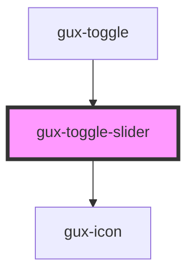

# gux-toggle-slider

<!-- Auto Generated Below -->

## Properties

| Property       | Attribute        | Description | Type      | Default |
| -------------- | ---------------- | ----------- | --------- | ------- |
| `checked`      | `checked`        |             | `boolean` | `false` |
| `disabled`     | `disabled`       |             | `boolean` | `false` |
| `errorId`      | `error-id`       |             | `string`  | `''`    |
| `guxAriaLabel` | `gux-aria-label` |             | `string`  | `''`    |
| `labelId`      | `label-id`       |             | `string`  | `''`    |

## CSS Custom Properties

| Name                                                 | Description |
| ---------------------------------------------------- | ----------- |
| `--gse-ui-toggle-focus-border-color;`                |             |
| `--gse-ui-toggle-focus-border-style`                 |             |
| `--gse-ui-toggle-focus-border-width`                 |             |
| `--gse-ui-toggle-focus-borderRadius`                 |             |
| `--gse-ui-toggle-focus-offset`                       |             |
| `--gse-ui-toggle-handle-backgroundColor`             |             |
| `--gse-ui-toggle-handle-borderRadius`                |             |
| `--gse-ui-toggle-handle-disabled-border-color`       |             |
| `--gse-ui-toggle-handle-disabled-border-style`       |             |
| `--gse-ui-toggle-handle-disabled-border-width`       |             |
| `--gse-ui-toggle-handle-enabled-border-color`        |             |
| `--gse-ui-toggle-handle-enabled-border-style`        |             |
| `--gse-ui-toggle-handle-enabled-border-width`        |             |
| `--gse-ui-toggle-handle-error-border-color`          |             |
| `--gse-ui-toggle-handle-error-border-style`          |             |
| `--gse-ui-toggle-handle-error-border-width`          |             |
| `--gse-ui-toggle-handle-foregroundColor`             |             |
| `--gse-ui-toggle-handle-height`                      |             |
| `--gse-ui-toggle-handle-hover-border-color`          |             |
| `--gse-ui-toggle-handle-hover-border-style`          |             |
| `--gse-ui-toggle-handle-hover-border-width`          |             |
| `--gse-ui-toggle-handle-width`                       |             |
| `--gse-ui-toggle-track-borderRadius`                 |             |
| `--gse-ui-toggle-track-disabled-off-backgroundColor` |             |
| `--gse-ui-toggle-track-disabled-on-backgroundColor`  |             |
| `--gse-ui-toggle-track-enabled-off-backgroundColor`  |             |
| `--gse-ui-toggle-track-enabled-on-backgroundColor`   |             |
| `--gse-ui-toggle-track-error-off-backgroundColor`    |             |
| `--gse-ui-toggle-track-error-on-backgroundColor`     |             |
| `--gse-ui-toggle-track-height`                       |             |
| `--gse-ui-toggle-track-hover-off-backgroundColor`    |             |
| `--gse-ui-toggle-track-hover-on-backgroundColor`     |             |
| `--gse-ui-toggle-track-width`                        |             |

## Dependencies

### Used by

 - [gux-toggle](..)

### Depends on

- [gux-icon](../../gux-icon)

### Graph

----------------------------------------------

*Built with [StencilJS](https://stenciljs.com/)*
